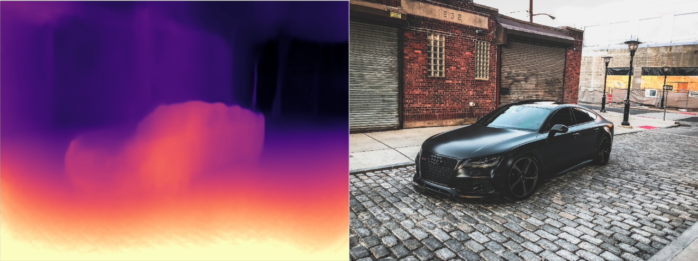

# Monodepth2 - TensorFlow 2

This is a TensorFlow 2 implementation of the original Monodepth2 PyTorch model, using the Keras Functional API.
An illustration of the model's overview is available at the model.png image.

Being such an implementation, it inherits all the copyrights and licensing accredited to the original authors at:
https://github.com/nianticlabs/monodepth2

Most prominent is the restriction for non-commercial use only (refer to the LICENSE file).

This repo is intended for those who'd prefer the TensorFlow-Keras framework, as well as being able to export the model with TensorFlow lite for edge devices (see the quantized model attached).

The model is based on the pre-trained PyTorch encoder & decoder for the single image mono_640x192 model.

## Inference example




## Paper citation

> **Digging into Self-Supervised Monocular Depth Prediction**
>
> [Clément Godard](http://www0.cs.ucl.ac.uk/staff/C.Godard/), [Oisin Mac Aodha](http://vision.caltech.edu/~macaodha/), [Michael Firman](http://www.michaelfirman.co.uk) and [Gabriel J. Brostow](http://www0.cs.ucl.ac.uk/staff/g.brostow/)  
>
> [ICCV 2019](https://arxiv.org/abs/1806.01260)


If you find their work useful in your research please consider citing their paper:

```
@article{monodepth2,
  title     = {Digging into Self-Supervised Monocular Depth Prediction},
  author    = {Cl{\'{e}}ment Godard and
               Oisin {Mac Aodha} and
               Michael Firman and
               Gabriel J. Brostow},
  booktitle = {The International Conference on Computer Vision (ICCV)},
  month = {October},
year = {2019}
}
```